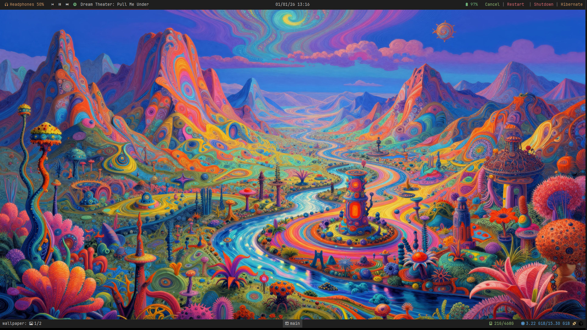
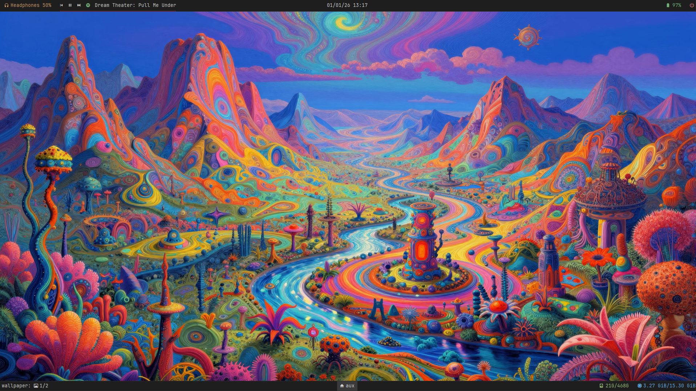

# Dotfiles - Minimalist Linux Environment

A clean, minimal, and productive Linux desktop configuration using i3 window manager, Polybar, Kitty terminal, and Zsh.

## Screenshots

### Main Workspace


### Development Workspace


### Auxiliary Workspace


### Terminal Scratchpad


### Spotify Integration


## Quick Start

Clone and install everything automatically:

```bash
git clone <your-repo-url> ~/dotfiles
cd ~/dotfiles
chmod +x install.sh
./install.sh
```

The installation script will:
- Backup existing configurations
- Install all system dependencies
- Install Oh My Zsh and plugins
- Install Python dependencies
- Create all symbolic links
- Install JetBrainsMono Nerd Font
- Configure everything automatically

**No manual steps required!** Just run the script and restart i3.

## Features

### i3 Window Manager
- **Modular Configuration**: Split into logical files for easy maintenance
- **Multi-monitor Support**: Workspaces assigned to specific monitors
- **Scratchpads**: Terminal and Spotify scratchpads for quick access
- **Keyboard Layout**: Brazilian (ABNT2) layout configured
- **Screenshots**: Flameshot integration with multiple shortcuts
- **Clipboard**: Clipmenu for clipboard history

### Polybar
- **Dual Bars**: Top and bottom bars per monitor
- **Spotify Integration**: Shows current track with dynamic album art colors
- **System Info**: Battery, disk, memory, audio controls
- **Workspace Indicator**: Visual workspace switcher
- **Minimalist Theme**: Clean dark theme with subtle colors

### Kitty
- **Modern Terminal**: Fast, feature-rich terminal emulator
- **GPU Acceleration**: Hardware-accelerated rendering
- **Customizable**: Extensive configuration options

### Picom
- **Rounded Corners**: 14px corner radius
- **Transparency**: Subtle transparency effects
- **Performance**: Optimized for smooth animations

### Zsh
- **Oh My Zsh**: Enhanced shell experience
- **Plugins**: 
  - `zsh-autosuggestions`: Command suggestions
  - `zsh-syntax-highlighting`: Syntax highlighting
- **Git Integration**: Useful git aliases and shortcuts

## ⌨️ Key Bindings

### Window Management
- `Mod + Return` - Open terminal
- `Mod + D` - Application launcher (dmenu)
- `Mod + Q` - Close window
- `Mod + F` - Toggle fullscreen
- `Mod + Space` - Toggle floating/tiling

### Workspaces
- `Mod + 1-0` - Switch to workspace
- `Mod + Shift + 1-0` - Move window to workspace

### Screenshots
- `Print` - Full screenshot
- `Mod + Print` - Interactive screenshot (flameshot GUI)
- `Shift + Print` - Screenshot screen 0
- `Mod + Shift + Print` - Screenshot screen 1

### Utilities
- `Mod + V` - Clipboard menu (clipmenu)
- `Mod + Shift + R` - Reload i3 configuration
- `Mod + Shift + E` - Exit i3

## Dependencies

All dependencies are automatically installed by the script:

### Core
- `i3` - Window manager
- `polybar` - Status bar
- `picom` - Compositor
- `zsh` - Shell
- `oh-my-zsh` - Zsh framework

### System Tools
- `dex` - Autostart manager
- `xss-lock` - Screen locker
- `i3lock` - Lock screen
- `nm-applet` - Network manager
- `dmenu` - Application launcher
- `flameshot` - Screenshot tool
- `feh` - Image viewer/wallpaper
- `clipmenu` - Clipboard manager
- `kitty` - Terminal emulator

### Python
- `python3-dbus` - D-Bus integration
- `colorthief` - Color extraction (for Spotify)

### Fonts
- `JetBrainsMono Nerd Font` - Main font

## Customization

### Monitors
Edit `i3/workspaces.conf` to configure workspace-to-monitor assignments:

```bash
workspace "1" output eDP-1
workspace "2" output DP-1-5
workspace "6" output DP-1-6
```

### Wallpaper
Place your wallpaper in `wallpaper/wallpaper.jpg` (or `.png`). It will be automatically loaded.

### Colors
Edit `i3/appearance_colors.conf` and `polybar/config.ini` to customize the color scheme.

### Keyboard Layout
Change the layout in `i3/autostart_additional.conf`:

```bash
exec --no-startup-id setxkbmap br  # Change 'br' to your layout
```

## Supported Distributions

The installation script automatically detects and supports:
- **Ubuntu/Debian** - Uses `apt`
- **Arch Linux/Manjaro** - Uses `pacman`
- **Fedora** - Uses `dnf`

For other distributions, install the dependencies manually and run the script. You may encounter issues on systems other than Ubuntu, as they have not been tested.

## 📝 Notes

- The script creates backups of existing configurations before installation
- All configurations use symbolic links, so updates are automatically synced
- The Spotify module requires Spotify to be running
- Some configurations are hardware-specific (monitors, keyboard) and may need adjustment

## 🎯 What Gets Installed

The installation script installs **everything** automatically:
1. System packages (i3, polybar, picom, etc.)
2. Oh My Zsh and plugins
3. Python dependencies
4. JetBrainsMono Nerd Font
5. Creates all configuration links
6. Sets up wallpaper
7. Configures shell

**Just run `./install.sh` and you're done!**

## License

Personal dotfiles — feel free to use and modify them as needed. I encourage you to do so.
